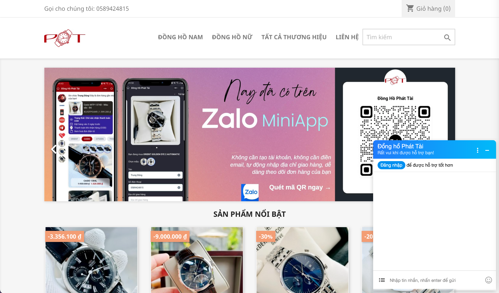

# Prestashop ZaloPay

Gắn widget chat qua Zalo lên website của bạn trong vòng 1 nốt nhạc

## Install

1. Vào mục release, tải file zalochat.zip về
2. Đăng nhập vào Admin cửa hàng Prestashop của bạn, cài đặt module bằng file zip vừa tải
3. Ở trang cấu hình module, nhập OAID và các config cần thiết

## Contributing

Nguyễn Hồng Phát

## License

This module is released under the [Academic Free License 3.0][AFL-3.0] 

[documentation]: https://devdocs.prestashop.com/1.7/modules/
[prestashop]: https://www.prestashop.com/
[contribution-guidelines]: https://devdocs.prestashop.com/1.7/contribute/contribution-guidelines/project-modules/
[AFL-3.0]: https://opensource.org/licenses/AFL-3.0
